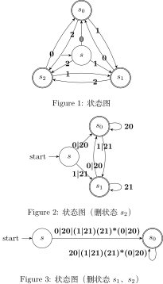

> 试写出下列语言的正则定义：
>
> 1）包含 5 个元音的小写字母串，这些串中的元音按顺序出现。  
> 2）所有由按词典递增序排列的小写字母组成的串。  
> 3）注释，即 `/*` 和 `*/` 之间的串，且串中没有不在双引号（`"`）中的 `*/`。  
> !! 4）所有不重复的数位组成的串。*提示*：首先尝试解决只含有少量数位（比如 `{0, 1, 2}`）的数位串。  
> !! 5）所有最多只有一个重复数位的串。  
> !! 6）所有由偶数个 a 和奇数个 b 构成的串。  
> 7）以非正式方式表示的国际象棋步法的集合，如 `p-k4` 或 `kbp×qn`。  
> !! 8）所有由 a 和 b 组成且不包含子串 abb 的串。  
> 9）所有由 a 和 b 组成且不含子序列 abb 的串。  

有些题因为太长所以用空格回车来分段了，自行无视空白字符即可。

### 1）包含 5 个元音的小写字母串，这些串中的元音按顺序出现。

定义 consonant `C = [bcdfghjklmnpqrstvwxyz]`；
```
C*
a(a|C)*
e(e|C)*
i(i|C)*
o(o|C)*
u(u|C)*
```

### 2）所有由按词典递增序排列的小写字母组成的串。
```
a*b*c*d*e*f*g*h*i*j*k*l*m*
n*o*p*q*r*s*t*u*v*w*x*y*z*
```

### 3）注释，即 `/*` 和 `*/` 之间的串，且串中没有不在双引号（`"`）中的 `*/`。

这什么屌题，题目都看不懂。

```
/\*
( "[^"]*"
| (\*)+
  ( "[^"]*"
  | [^*/]
  )
| [^*]
)*
(\*)+/
```

解释一下：  
第一行是 `/*`；  
第二行开始到第八行是注释内容，分三部分；  
第二行是第一部分，是被引号包围的处理，用来特殊处理被引号包围的 `*/`，`[^"]` 是单字符非贪婪匹配的一种实现方式；  
第三四五六行是第二部分，匹配星号，做这个处理是为了防止后续不匹配上 `/`，否则注释就闭合了；  
其中第四行第五行是因为需要向前看一个字符，会导致正则多吃一个字符，所以需要再把注释中可能出现的情况重新枚举了一下；  
第七行匹配任意其它字符，注释中本来就啥都可以写，除此外排除了后面只剩下 `*` 的特殊情况，这个在最后匹配；  
第八行表示注释内容中间的部分重复任意多次（包括为空）；  
第九行是注释的闭合 `*/`，`\*+` 是为了匹配最后都是 `*` 的特殊情况。

因为没有书中没有提供惰性模式的定义，所以这里也不使用惰性模式来解决 `/**/*/` 的问题，而是采用了比较崎岖的方法。

几个测试用例：
* 可以匹配：`/**/` `/* comments */` `/***/` `/****/` `/*"*/` `/**"*/` `/*"*/"*/` `/***"*/"*/` `/*"/**/"*/` `/*/*/` `/***x*/`
* 无法匹配：`/*/` `/*"*/"` `/*""*/"*/` `/**/*/` `/***/*/`

备注一下，如果允许使用惰性模式，那就简单很多了：`/\*(".*?"|[^"]*?)\*/`

### !! 4）所有不重复的数位组成的串。*提示*：首先尝试解决只含有少量数位（比如 `{0, 1, 2}`）的数位串。

这题我一开始对于题目的理解完全出错了，我本以为是求所有 10 个数字的全排列；  
如果是那样的话状态就很复杂了，10 个数字论是否已经出现就有 1024 种状态，真的写出正则定义来恐怕也理不清吧；  
我还试着画过状态图：3 个数字还好，共 8 个状态就 1 3 3 1，还算清晰，但是数字到 5 个的时候转移就混乱了，10 个的时候就只剩十团分别缠在一起的黑线了。  
后来去和同学吐槽了一下这题，同学指出来题目应该不是这个意思，是说数位不能连续出现三次或以上（当时吐槽的是下一题，即第 5 题，回过头来想了一下这题也是这意思）。  
我又去搜了一下原题，结果发现了这个 [StackOverflow 问题](https://stackoverflow.com/questions/7547583)，看了下高赞回答的图就是这个意思。  

**以上是碎碎念。**

题目意思是不能有连续的 **11** **22** 这类重复数字作为子串，但是可以作为子序列出现（就是可以出现多次，但是不能连续啦）。

那其实还算简单的，这一题的状态机只要状态节点表示当前数字是什么，然后有向无自环完全图就是了。

下图是简化版问题的状态机到正则的一个转化。  
需要注意的是，下图最后只留下了 s0 状态，这意味着最后一个字符只能是 `0`。  
但是实际上 s1 和 s2 也是接受状态，也就是说信息丢失了。  
实际上，我们应该削除状态到只剩 s0, s1 和 s2，三种都进行一遍，最后答案汇总起来才是正解。



按理来说 DFA 和正则是等价的，给出 DFA 就相当于是给出了正则定义，是符合题目要求的。

如果一定要给出文字的定义（毕竟下一节 [Exercise 3.4.2](../../3.4%20Transition%20Diagrams/Exercise%203.4.2) 有要求给状态机图的），那十个数字的还是太麻烦了。  
应该还是有其它递归方法能求出正则定义的，这个留着待办吧。

十个数字的完整的状态图和 tex 文件就见 [Exercise 3.4.2](../../3.4%20Transition%20Diagrams/Exercise%203.4.2) 的对应问题吧，这里引用一下图。


### !! 5）所有最多只有一个重复数位的串。

注意这题虽然中文表述和上一题有所差异，但是英文原题是几乎一致的，所以讨论后我才意识到上一题我也做错了。

- All strings of digits with no repeated digits.
- All Strings of digits with at most one repeated digit.

题意是不能出现 **111** 或 **222** 这种三连的子串，而*不是*说任意某个数字在整个字符串中只能出现最多 2 次，其它数字最多只能一次。

这就是多了一层状态，内层表示重复一次，外层表示重复两次，两次之后就不能往外了，只能往内层其它状态跳，这样就阻止了三连的出现。  
描述起来麻烦，直接见图吧（老实说，图应该比描述更混乱）。

正则定义也不方便给，引用一下 [Exercise 3.4.2](../../3.4%20Transition%20Diagrams/Exercise%203.4.2) 的图。


### !! 6）所有由偶数个 a 和奇数个 b 构成的串。

这是一道很典型的题，用状态机来做是最佳选择。

我们有四种状态，包括 a 出现偶数次或奇数次，b 出现偶数次或奇数次，这 2\*2 种组合。

方便起见，下文用 `a0b0` 表示 a 偶 b 偶，`a0b1` 表示 a 偶 b 奇，`a1b0` 表示 a 奇 b 偶，`a1b1` 表示 a 奇 b 奇。

它们之间的状态转移也很清晰，就是多个 a 或者 b 的事情。开始节点显然是 `a0b0`，终结节点则根据题目要求是 `a0b1`。

然后开始消除状态，[详情见图](http://magjac.com/graphviz-visual-editor/?dot=digraph%20finite_state_machine%7Bsubgraph%20cluster_origin%7Blabel%3D%22%E5%88%9D%E5%A7%8B%22%3Bnode%5Bshape%3Ddoublecircle%5D%3Borigin_a0b0%20origin_a0b1%3Bnode%5Bshape%3Dcircle%2Cnodesep%3D3%5D%3B%7Brank%3Dsame%3Borigin_a0b0%5Blabel%3Da0b0%5D%3Borigin_a1b0%5Blabel%3Da1b0%5D%3B%7D%7Brank%3Dsame%3Borigin_a0b1%5Blabel%3Da0b1%5D%3Borigin_a1b1%5Blabel%3Da1b1%5D%3B%7Dorigin_a0b0-%3Eorigin_a1b0-%3Eorigin_a0b0%5Blabel%3Da%5D%3Borigin_a0b0-%3Eorigin_a0b1-%3Eorigin_a0b0%5Blabel%3Db%5D%3Borigin_a1b1-%3Eorigin_a0b1-%3Eorigin_a1b1%5Blabel%3Da%5D%3Borigin_a1b1%3Ane-%3Eorigin_a1b0%5Blabel%3Db%5D%3Borigin_a1b0-%3Eorigin_a1b1%5Blabel%3Db%5D%3B%7Dsubgraph%20cluster_first%7Blabel%3D%22%E6%B6%88%E5%8E%BBa1b0%22%3Bnode%5Bshape%3Ddoublecircle%5D%3Bfirst_a0b0%20first_a0b1%3Bnode%5Bshape%3Dcircle%5D%3Bfirst_a0b0%5Blabel%3Da0b0%5D%3B%7Brank%3Dsame%3Bfirst_a0b1%5Blabel%3Da0b1%5D%3Bfirst_a1b1%5Blabel%3Da1b1%5D%3B%7Dfirst_a0b0-%3Efirst_a0b0%5Blabel%3Daa%5D%3Bfirst_a0b0-%3Efirst_a0b1-%3Efirst_a0b0%5Blabel%3Db%5D%3Bfirst_a1b1-%3Efirst_a0b1-%3Efirst_a1b1%5Blabel%3Da%5D%3Bfirst_a1b1-%3Efirst_a1b1%5Blabel%3Dbb%5D%3Bfirst_a0b0-%3Efirst_a1b1%5Blabel%3Dab%5D%3Bfirst_a1b1-%3Efirst_a0b0%5Blabel%3Dba%5D%3B%7Dsubgraph%20cluster_second%20%7Blabel%3D%22%E6%B6%88%E5%8E%BBa1b1%22%3Bnode%5Bshape%3Ddoublecircle%5D%3Bsecond_a0b0%20second_a0b1%3Bnode%5Bshape%3Dcircle%5D%3Bsecond_a0b0%5Blabel%3Da0b0%5D%3Bsecond_a0b1%5Blabel%3Da0b1%5D%3Bsecond_a0b0-%3Esecond_a0b0%5Blabel%3D%22a%28bb%29%2Aa%22%5D%3Bsecond_a0b1-%3Esecond_a0b1%5Blabel%3D%22a%28bb%29%2Aa%22%5D%3Bsecond_a0b0-%3Esecond_a0b1%5Blabel%3D%22b%7Ca%28bb%29%2Aba%22%5D%3Bsecond_a0b1-%3Esecond_a0b0%3B%7D%7D)，格式化的源码见同目录 [graphviz](./6.gv) 文件，最后很清晰就是

```
S = a(bb)*a
T = b|a(bb)*ba
S*T(S|TT)*
```
### 7）以非正式方式表示的国际象棋步法的集合，如 `p-k4` 或 `kbp×qn`。

不会国际象棋，这题没啥兴趣先跳过，之后有空了再做。

### !! 8）所有由 a 和 b 组成且不包含子串 abb 的串。

换句话说就是，如果出现了一个 `a`，后面最多只能接一个 `b`。

答案是 `b*(a+b?)*`。

### 9）所有由 a 和 b 组成且不含子序列 abb 的串。

子序列的和子串的区别是可以中间跨其它字符。

原题换句话说就是，当出现第一个 `a` 后，后面的串就最多只能出现一个 `b` 了。

答案是 `b*(a+b?a*)?`。
