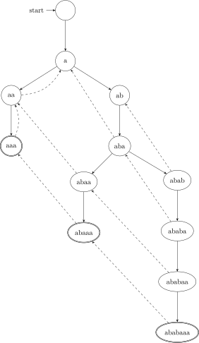
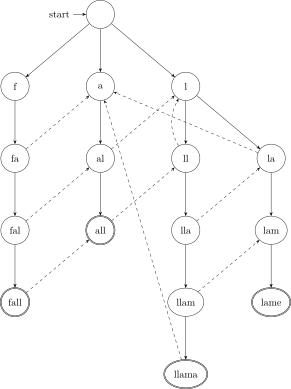
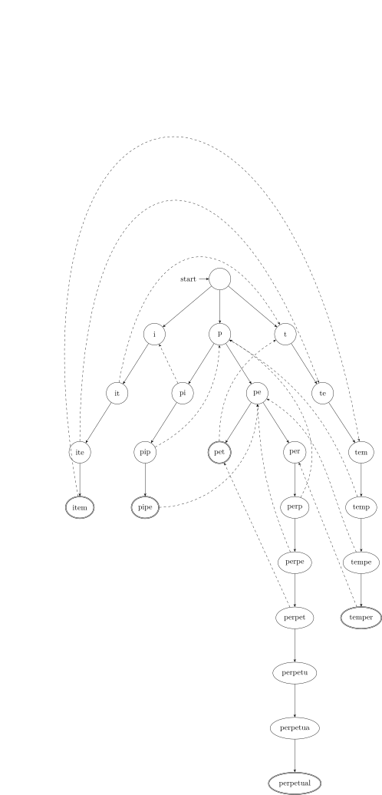

> 为下面的关键字集合构造 trie 以及失效函数。
>
> 1) `aaa`、`abaaa` 和 `ababaaa`。  
> 2）`all`、`fall`、`llama` 和 `lame`。  
> 3）`pipe`、`pet`、`item`、`temper` 和 `perpetual`。  

实线是 Trie 树的父亲指向儿子的边。

虚线是 AC 自动机的失效指针。

理论中每个状态都有失效指针，图中无失效指针的节点只是没画，其失效指针均指向根。

