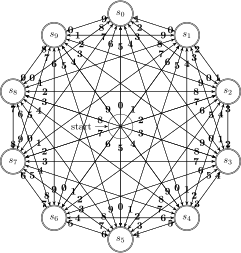
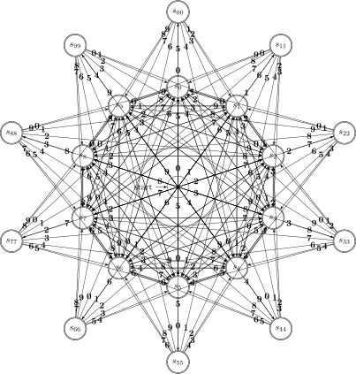
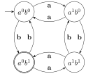

> 给出识别联系 3.3.5 中各个正则表达式所描述的语言的状态转换图。

### 1）包含 5 个元音的小写字母串，这些串中的元音按顺序出现。

想着画一个 DFA 吧，结果平白多了好多线，果然还是太难看了吗。

### 2）所有由按词典递增序排列的小写字母组成的串。

这要是 DFA 整张图就废了，还是 NFA 吧。

### 3）注释，即 `/*` 和 `*/` 之间的串，且串中没有不在双引号（`"`）中的 `*/`。

### 4）所有不重复的数位组成的串。*提示*：首先尝试解决只含有少量数位（比如 `{0, 1, 2}`）的数位串。

### 5）有最多只有一个重复数位的串。

### 6）所有由偶数个 a 和奇数个 b 构成的串。

### 7）以非正式方式表示的国际象棋步法的集合，如 `p-k4` 或 `kbp×qn`。

待办。

### !! 8）所有由 a 和 b 组成且不包含子串 abb 的串。

### 9）所有由 a 和 b 组成且不包含子序列 abb 的串。

